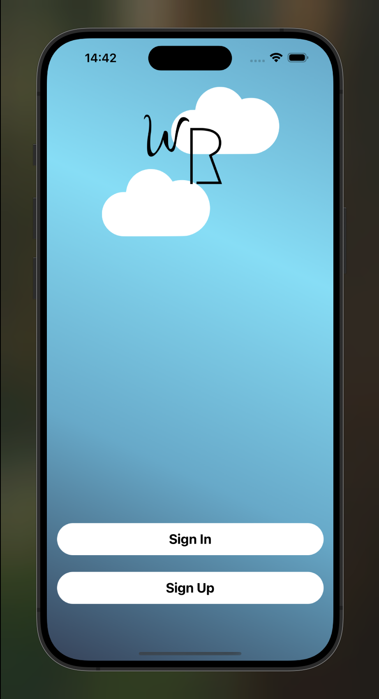
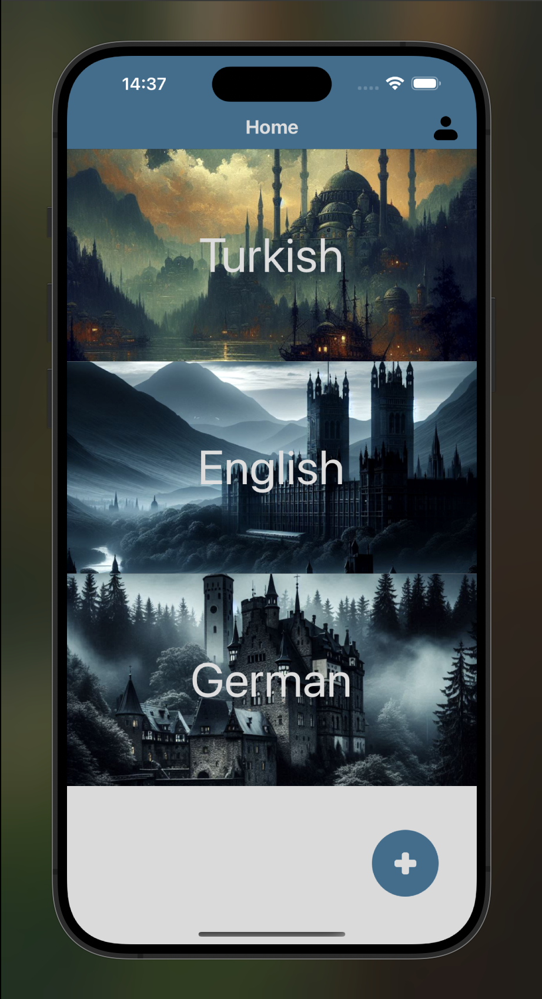
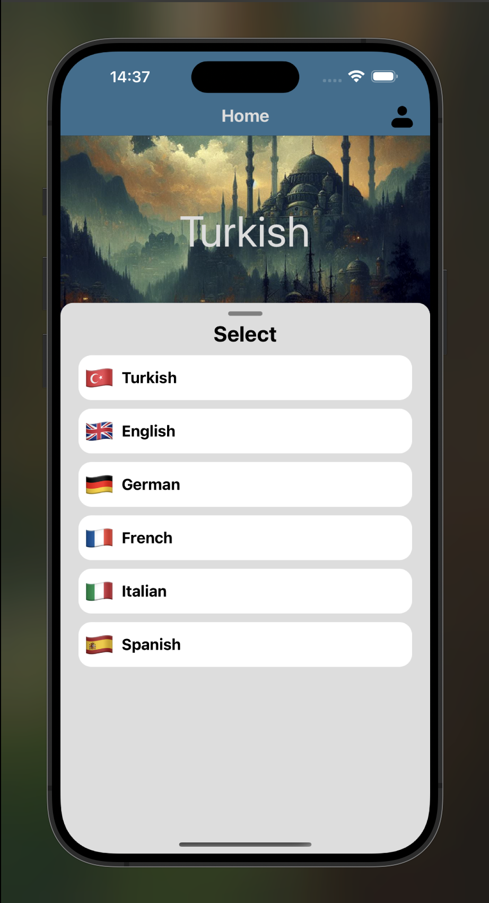
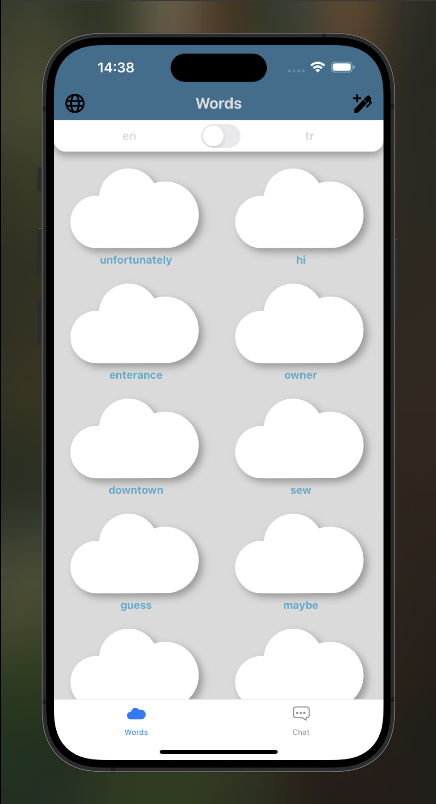
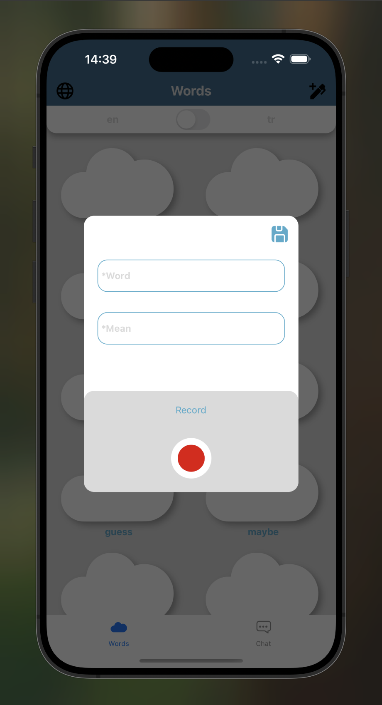

# Word Repo

## Hakkında
Bu proje  kullanıcıların dil öğrenme yolculuğunda  kelime hazinelerini artırmaya ve telafuz  pratiğini yapabilmelerine yardımcı olmak için geliştirilmekte olan bir projedir.

## Özellikler
- İstediğiniz dilde kelime destesi oluşturma.
- Kelime kaydetme
- Kelime telafuz kaydetme
- Ana dil ve öğrenilen dile pratik için çift yönlü deste listeleme.

## Kullanılan Teknolojiler
- **Frontend:** React Native
- **Backend:** Node.js, Express.js
- **Veri Tabanı:** MongoDB

  
  
  
  
  

